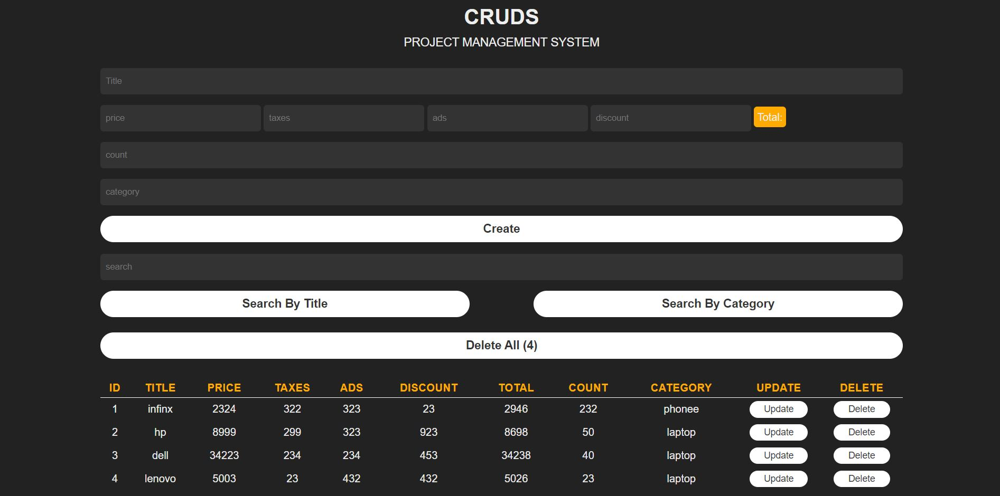

# CRUDS System Application

A CRUDS app is a specific type of software application that consists of four basic operations; Create, Read, Update, Delete and Search

# Screen Shot

# Technology Used

- HTML
- CSS
- JavaScript

# Features

- Creates products
- Get total prices
- Show data in table
- Saving data in local storage
- Update data
- Delete one product or Delete all products
- Search for a product by name or category

# Live Site

[Demo](https://ahmedbedeir.github.io/cruds-system/)
